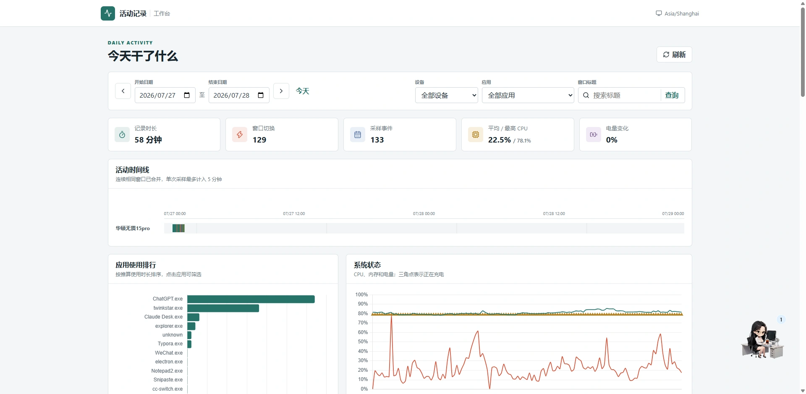
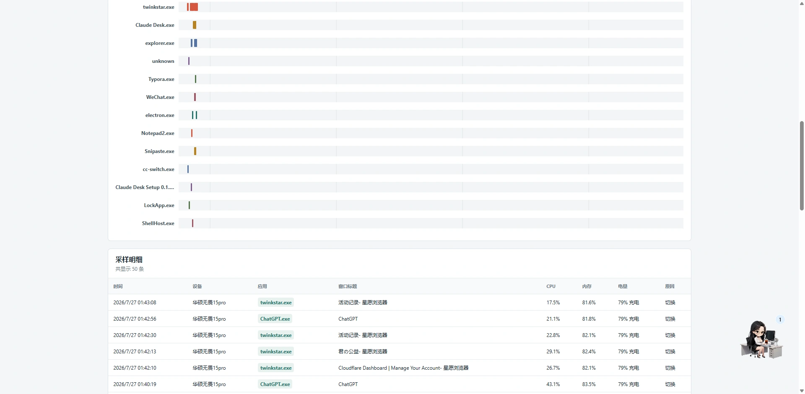

# Activity Recorder

一套运行在 Cloudflare Workers + D1 上的 Windows 活动记录工具。客户端在前台窗口变化时采样，并在窗口不变时每 5 分钟发送一次心跳；仪表盘用于按日期、设备、应用和窗口标题回顾记录。

## 功能

- Windows 前台进程和窗口标题采集，不采集网址、截图、键盘内容或用户名。
- CPU、内存、电量、充电状态、设备型号和系统信息。
- SQLite 离线队列、幂等事件 ID、最多 100 条批量补传和指数退避。
- D1 永久存储，多设备自动区分。
- 日期范围、设备、应用和标题筛选，包含时间线、应用排行、系统折线及分页明细。
- 写入令牌与仪表盘密码分离；未设置仪表盘密码时页面公开。



## 前置条件

- Cloudflare 账户。
- Node.js 20 或更高版本。
- Windows 10/11 和 Python 3.11 或更高版本（`py -3` 或 `python` 可用）。

## 部署 Cloudflare

### 1. 安装并登录

```powershell
npm install
npx wrangler login
```

### 2. 创建 D1

```powershell
npx wrangler d1 create activity-recorder
```

命令会输出 `database_id`。将 [wrangler.jsonc](./wrangler.jsonc) 中的 `replace-with-your-d1-database-id` 替换为这个值，然后执行远程迁移：

```powershell
npm run db:migrate:remote
```

### 3. 配置 Secrets

先准备两个互不相同、至少 32 字节的随机值。`INGEST_TOKEN` 提供给 Windows 客户端，`SESSION_SECRET` 只保存在 Cloudflare。

```powershell
npx wrangler secret put INGEST_TOKEN
npx wrangler secret put SESSION_SECRET
```

如需仪表盘密码，再设置：

```powershell
npx wrangler secret put DASHBOARD_PASSWORD
```

不设置 `DASHBOARD_PASSWORD` 时，任何知道 Worker 地址的人都可以查看记录。若之前设置过并希望改为公开：

```powershell
npx wrangler secret delete DASHBOARD_PASSWORD
```

### 4. 部署

```powershell
npm run deploy
```

Wrangler 会输出类似 `https://activity-recorder.<subdomain>.workers.dev` 的地址。打开该地址即可访问仪表盘。

## 安装 Windows 客户端

在仓库根目录执行，`Token` 必须与 Cloudflare 的 `INGEST_TOKEN` 完全一致：

```powershell
Set-ExecutionPolicy -Scope Process Bypass
.\client\install.ps1 `
  -Endpoint "https://activity-recorder.<subdomain>.workers.dev" `
  -Token "你的 INGEST_TOKEN" `
  -DeviceName "工作电脑"
```

安装脚本会：

- 将程序安装到 `%LOCALAPPDATA%\ActivityRecorder\app`。
- 创建独立 Python 虚拟环境并安装 `psutil`。
- 创建或更新 `%LOCALAPPDATA%\ActivityRecorder\config.json`，重复安装时保留设备 ID。
- 注册当前用户登录后启动的 `ActivityRecorder` 计划任务，并立即启动。

查看状态和最近日志：

```powershell
.\client\status.ps1
```

临时暂停采集（默认 5 分钟）：

```powershell
.\client\pause.ps1
.\client\pause.ps1 -Minutes 30
```

暂停期间不会读取前台窗口或生成新事件，到期后自动恢复。提前恢复：

```powershell
.\client\resume.ps1
```

卸载程序但保留配置、日志和未上传队列：

```powershell
.\client\uninstall.ps1
```

同时删除所有本地数据：

```powershell
.\client\uninstall.ps1 -RemoveData
```

`-RemoveData` 删除的本地队列不可恢复；已经上传至 D1 的记录不会受影响。

## 本地开发

复制本地 Secrets 示例并填写值：

```powershell
Copy-Item .dev.vars.example .dev.vars
npm run db:migrate:local
npm run dev
```

`npm run dev` 会先构建仪表盘，再由 Wrangler 启动包含 Worker、静态资源和本地 D1 的完整服务。只需要前端热更新时可使用 `npm run dev:web`，但该模式不提供 API。

客户端可直接前台运行以便排错：

```powershell
python -m pip install -r client\requirements.txt
python client\run.py
```

前台运行仍会读取 `%LOCALAPPDATA%\ActivityRecorder\config.json`。

## 测试

```powershell
npm test
npm run test:client
npm run test:e2e
npm run build
npx wrangler deploy --dry-run
```

Worker 测试运行在 Cloudflare Workers 本地运行时并绑定隔离的 D1。前端测试使用 jsdom，客户端测试使用 Python `unittest`。

## 数据与统计规则

每次上传的数据形状如下：

```json
{
  "events": [
    {
      "id": "uuid",
      "observedAt": "2026-07-26T08:00:00.000Z",
      "trigger": "window_change",
      "device": {
        "id": "persistent-device-uuid",
        "name": "工作电脑",
        "manufacturer": "Example",
        "model": "Model A",
        "osVersion": "Windows 11",
        "cpuModel": "Example CPU"
      },
      "activity": {
        "processName": "code.exe",
        "windowTitle": "Activity Recorder"
      },
      "metrics": {
        "cpuPercent": 12.5,
        "memoryPercent": 43.2,
        "batteryPercent": 78,
        "powerPlugged": true
      }
    }
  ]
}
```

数据库统一保存 UTC 毫秒时间戳，仪表盘按浏览器当前时区生成日期边界。相邻采样点用于推算活动时长，每段最多计入 5 分钟；连续相同窗口会合并。客户端没有空闲检测，因此用户离开电脑但窗口不变时，仍可能通过心跳计入该应用。

详细报表单次最多查询连续 7 天，并最多读取 20,000 条采样。超过 20,000 条时页面会提示进一步缩小日期范围；原始数据不会因此丢失，明细 API 仍可分页查询。

## 常见问题

- 客户端没有记录：运行 `client\status.ps1`，检查计划任务状态和 `recorder.log`。
- 队列持续增长：确认 Endpoint 使用 HTTPS、令牌与 `INGEST_TOKEN` 一致，并检查 Worker 日志。
- 页面显示未配置：设置了 `DASHBOARD_PASSWORD` 时也必须设置 `SESSION_SECRET`。
- 修改数据库结构：新增迁移文件后先运行本地迁移和测试，再执行 `npm run db:migrate:remote`。
